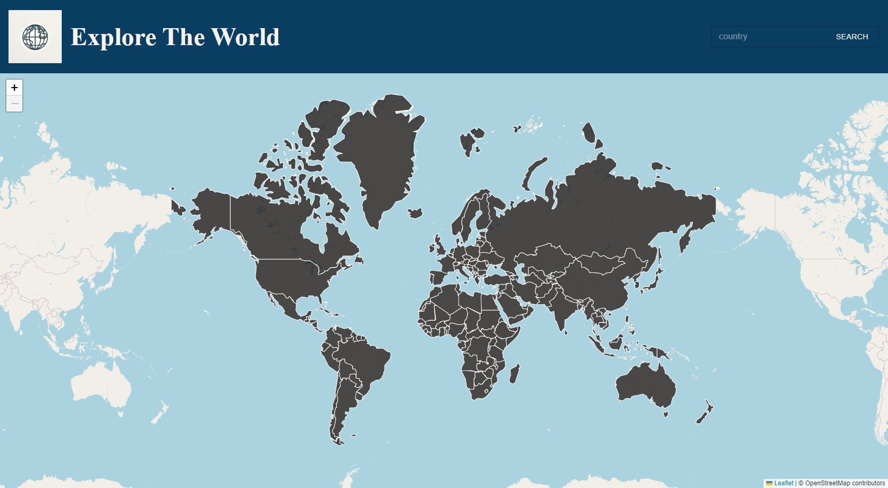
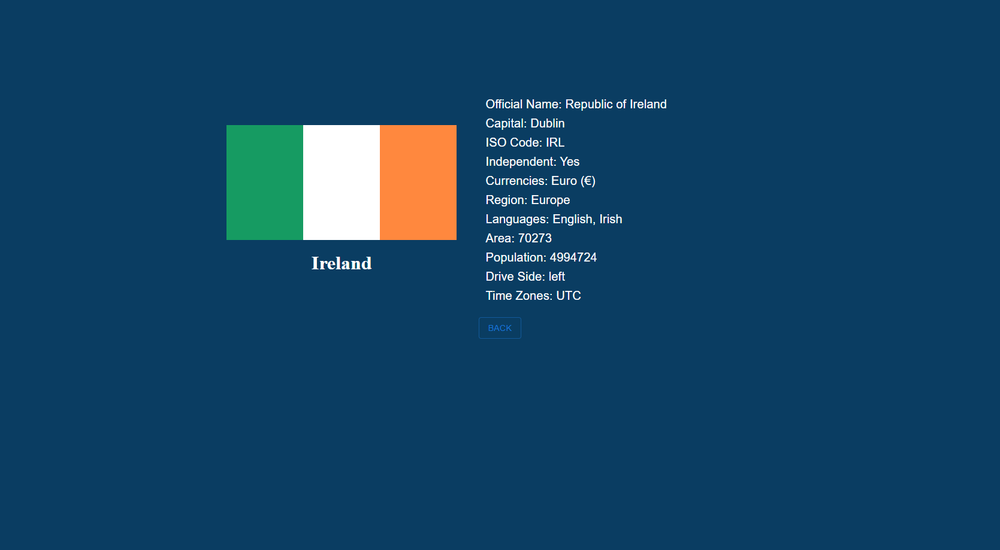

## Intro

This is a web app to explore the world. Users can get detailed information about a country by searching its name or click it on the map.

The data is from the open source *REST COUNTRIES* ([Official Page](https://restcountries.com/)).

[Web Link](https://map-viewer-front.vercel.app/)

## ScreenShot




## Tech-stack
React

Node.js

Express

Leaflet

axios

jest + supertest

## How to run this app
### Requirments
To run the front-end server, you need Node.js and the package manager installed in your machine.
How to check:
```
node -v
npm -v
```
You are expected to see the version. If not, follow the official website [here](https://nodejs.org/en).
### Front-end
#### Run the development environment

From the root directory, run:
```
cd .\front-end\viewer\
npm i
npm run dev
```
You should see the front-end running (usually on port 5137)
### Back-end
#### Run the development environment

From the root directory, go to `./back-end/src/app.js` file, comment line 8 and uncomment line 9. This is for local test.
Then run:

```
cd .\back-end
npm i
node \src\server.js
```

You should see the back-end server running (usually on port 3001)

Now you can go to [local web](http://localhost:5173/) to explore this app!